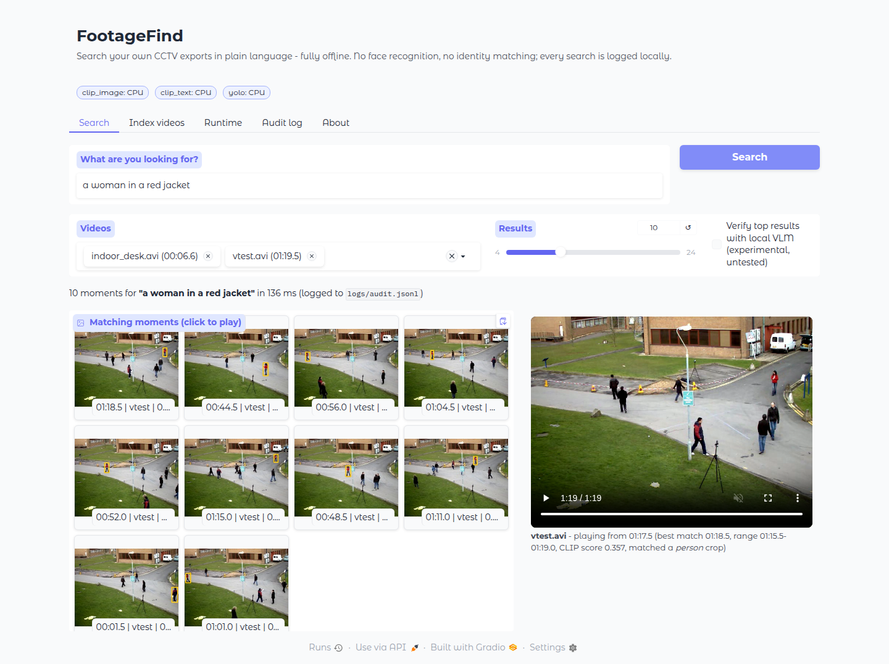
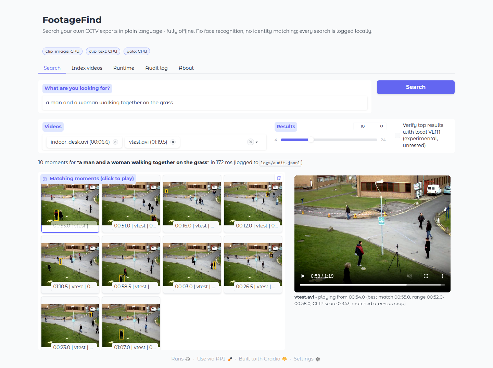
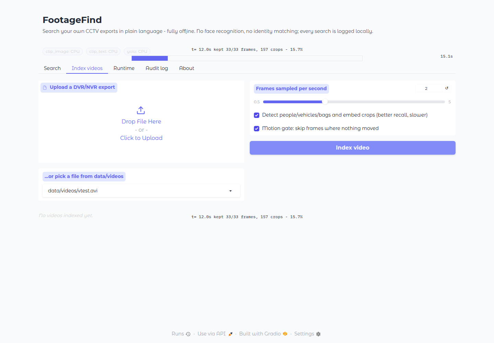
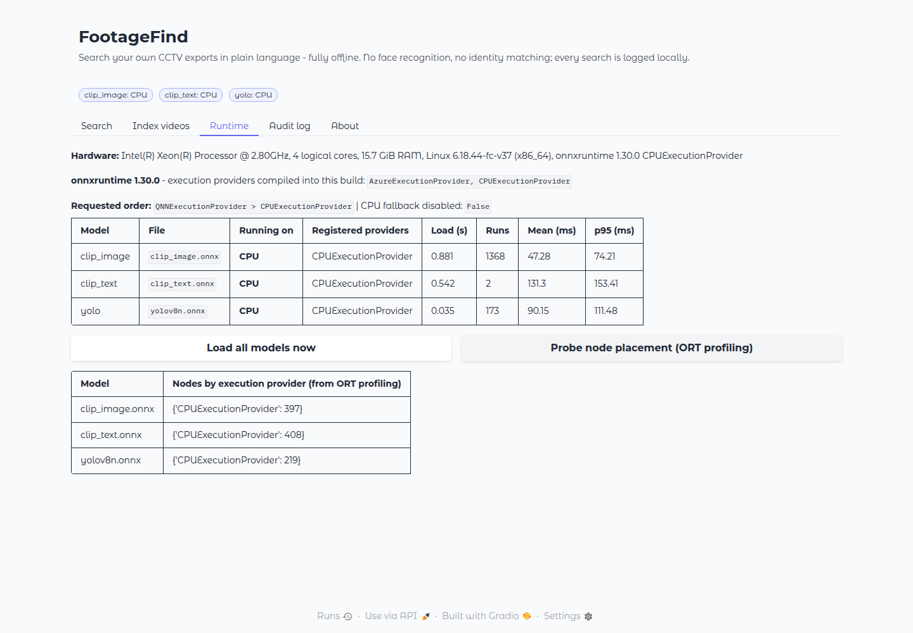
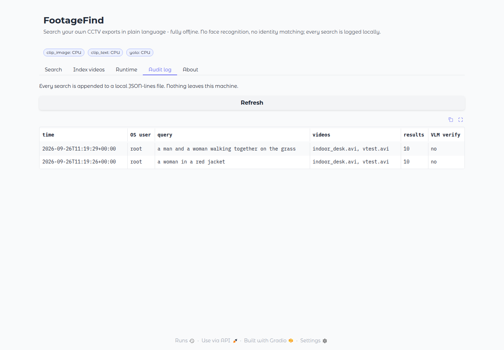
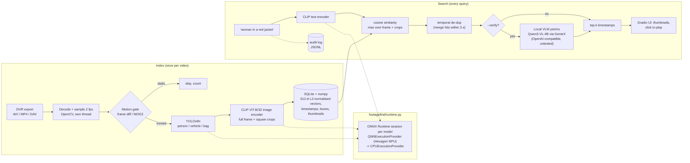

# FootageFind

**Type what happened, get the timestamps.** FootageFind is offline, natural-language search over the
CCTV footage you have already exported from your DVR/NVR. It is built for Snapdragon X-series AI PCs
(Windows 11 on ARM, Hexagon NPU).

> *"person carrying a large bag near the gate"* -> `00:44.5`, `01:12.0`, `01:18.5` ... click, and the clip plays from there.

Built for the **Qualcomm Snapdragon AI Lab Build & Present Challenge (India, 2026)**.

---

## Why

After a theft at a kirana store, a scooter going missing from a housing society, or a dispute at a
small office, someone has to sit and scrub through hours of DVR exports at 4x speed. The people doing
it (shop owners, society secretaries, office managers) are not security professionals, and the
footage is sensitive: it shows neighbours, customers and staff. Uploading it to a cloud video-AI
service is expensive, slow on Indian uplinks, and a privacy problem.

FootageFind runs **entirely on the laptop**. You drop in the export, it indexes the video once, and then
you search it in plain English as often as you like. No internet connection, no account, no
telemetry. There is **no face recognition and no identity matching**. It finds *moments that look
like a description*, and every search is written to a local audit log.

## Screenshots

Captured with Playwright from the running app on the x86 build VM (CPU execution provider).

| Search: "a woman in a red jacket" | Click a result: plays from that moment |
|---|---|
|  |  |

| Indexing with progress | Runtime: which execution provider each model is on | Audit log |
|---|---|---|
|  |  |  |

## How it works



* **One inference path for every device.** All three models are exported to static-shape ONNX
  (`scripts/export_onnx.py`) and run through `footagefind/runtime.py`, which asks for
  `QNNExecutionProvider` (Hexagon NPU, `QnnHtp.dll`) first and falls back to CPU. PyTorch is not
  used at runtime, and the CLIP tokenizer is vendored so the device needs no torch.
* **Crops matter.** In CCTV a person fills about 1% of the frame. Embedding YOLO person/vehicle/bag
  crops next to the full frame raises Recall@1 from 0.56 to 0.94 on our test queries (table below).
* **Motion gate.** Idle footage is skipped before any model runs. A heartbeat still keeps one frame
  every 30 s so parked vehicles and left bags stay searchable.
* **De-duplication.** Adjacent frames of the same event are merged into one result (greedy temporal
  NMS anchored on the best frame), so the top 10 contains 10 different moments.
* **Optional VLM verification.** `--verify` asks a local vision-language model "Does this image show:
  *query*?" for the top-k and re-ranks. It targets Qwen3-VL-4B-Instruct via Qualcomm GenieX's
  OpenAI-compatible `geniex serve` endpoint and is started lazily. **This path is untested** (no VLM
  was available in the build environment); only the client was tested, against a stub server.

## Results (measured, CPU only)

All numbers: `python eval/run_eval.py` on an **Intel Xeon @ 2.80 GHz (4 vCPU, KVM virtual machine), 15.7 GiB RAM,
Linux x86-64, ONNX Runtime 1.30.0 CPUExecutionProvider**, 2026-09-26. 16 queries with hand-labelled ground truth over
`vtest.avi` (79.5 s) + `indoor_desk.avi` (6.6 s). Full tables, per-query ranks and method:
**[results/RESULTS.md](results/RESULTS.md)** (raw: `results/cpu_eval.json`).

| Configuration (sampling 2 fps, merge 3 s) | Recall@1 | Recall@5 | Recall@10 | MRR | Index time, 86 s of video |
|---|---|---|---|---|---|
| **Frames + YOLO crops, FP32 (default)** | **0.94** | 0.94 | 1.00 | 0.95 | 76.9 s |
| Full frames only, FP32 | 0.56 | 0.88 | 0.94 | 0.64 | 10.3 s |
| Frames + crops, CLIP INT8 w8a8 (ORT static QDQ) | 0.75 | 0.94 | 1.00 | 0.84 | 56.7 s |
| Frames + crops, CLIP w8a16 (NPU-target numerics, run on CPU) | 0.94 | 1.00 | 1.00 | 0.95 | 391.5 s* |
| Frames + crops, CLIP **and** YOLO w8a16 (full NPU-target numerics) | 0.88 | 0.94 | 1.00 | 0.91 | 403.3 s* |

\* w8a16 QDQ is emulated on x86 and is ~7x slower than FP32 there; it is the format the Hexagon NPU executes
natively. These rows preview **accuracy** on the NPU, not speed. Approximate random-ranking Recall@1: 0.18.

* **Crops are the biggest win**: event-level Recall@1 0.46 -> 1.00.
* **w8a16 keeps accuracy, w8a8 does not**: mean cosine to FP32 embeddings is 0.999 (w8a16) vs 0.85 image /
  0.79 text (w8a8).
* **Motion gate** (synthetic clip: vtest padded with 2 x 60 s of frozen, noisy frames): skipped 236 of 413 sampled
  frames, cut indexing from 180.9 s to 80.0 s, and Recall@1 went *up* (0.81 -> 0.88) because idle frames no longer
  compete in the ranking. On the real vtest clip it skips nothing, because people are moving in every frame.
* **Per-model CPU latency** (batch 1, mean / p95): CLIP image 40.7 / 49.6 ms, CLIP text 37.0 / 45.1 ms,
  YOLOv8n 44.4 / 52.2 ms. End-to-end query: 103 ms mean.

### Snapdragon X (AI Hub / on-device) - to be measured

| Model | Precision | Snapdragon X Elite CRD latency | Snapdragon X Plus 8-Core CRD latency | Compute unit | Peak memory |
|---|---|---|---|---|---|
| CLIP ViT-B/32 image | w8a16 | | | | |
| CLIP ViT-B/32 text | w8a16 | | | | |
| YOLOv8n | w8a16 | | | | |

Nothing here has been measured. Run `scripts/aihub_compile_profile.py` (needs an AI Hub token) and
`eval/run_eval.py --config configs/snapdragon.toml` on a device to fill it.

## Setup

### (a) x86-64 / any CPU (development, what was tested)

```bash
python -m venv .venv && source .venv/bin/activate          # Python 3.11
pip install torch --index-url https://download.pytorch.org/whl/cpu   # CPU-only torch is enough
pip install -r requirements.txt
python scripts/download_assets.py        # CLIP + YOLO weights, test clips (GitHub-hosted, SHA-256 checked)
python scripts/export_onnx.py            # -> models/onnx/{clip_image,clip_text,yolov8n}.onnx
python scripts/quantize_onnx.py          # optional: *.int8.onnx (CPU) and *.w8a16.onnx (NPU target)

python -m footagefind index data/videos/vtest.avi data/videos/indoor_desk.avi
python -m footagefind search "a woman in a red jacket" -k 5
python -m footagefind.app                # http://127.0.0.1:7860
python -m pytest -q                      # 41 tests
python eval/run_eval.py                  # regenerates results/cpu_eval.json + results/RESULTS.md
```

### (b) Windows 11 on Snapdragon X (Hexagon NPU) - untested on device

```powershell
# native ARM64 Python 3.11/3.12 from python.org
py -3.11-arm64 -m venv .venv ; .venv\Scripts\activate
pip install -r requirements-snapdragon.txt           # onnxruntime-qnn, numpy, opencv, gradio
python -c "import onnxruntime as ort; print(ort.get_available_providers())"   # expect QNNExecutionProvider
# copy models/onnx/ (incl. *.w8a16.onnx) from the dev box, then:
python scripts/download_assets.py --videos
python -m footagefind --config configs/snapdragon.toml runtime     # EP per model + node placement
python -m footagefind.app --config configs/snapdragon.toml
```

`configs/snapdragon.toml` loads the w8a16 QDQ models, enables QNN context-binary caching and sets
`disable_cpu_ep_fallback = true`, so a model that cannot run fully on the NPU fails loudly instead of
silently running on the CPU. See **[docs/SNAPDRAGON.md](docs/SNAPDRAGON.md)** for exactly what
changes on device and how to verify NPU use (Task Manager NPU graph, ORT profiling).
`scripts/aihub_compile_profile.py` compiles and profiles all three models on *Snapdragon X Elite CRD*
and *Snapdragon X Plus 8-Core CRD* through Qualcomm AI Hub. It needs an API token and **has not been
run**.

## Using it

| | |
|---|---|
| `python -m footagefind index <videos...> [--fps 2] [--no-crops] [--no-motion] [--motion-method mog2]` | index one or more exports |
| `python -m footagefind search "<query>" [-k 10] [--verify] [--frames-only] [--json]` | search everything indexed |
| `python -m footagefind runtime` | which execution provider each model loaded on + per-node placement |
| `python -m footagefind audit --last 20` | show the query audit log |
| `python -m footagefind.app [--config ...] [--port 7860]` | the UI |

Configuration lives in `configs/default.toml` (sampling rate, motion thresholds, detector classes,
merge window, VLM endpoint, audit-log path). Pass `--config other.toml` to override any part of it.

## Ethics, privacy and responsible use

* **No face recognition, no identity matching, no person re-identification.** FootageFind never
  computes face embeddings or matches a person across videos. Queries describe appearance and
  actions ("red jacket", "carrying a bag"), and the answer is "these moments look like that", never
  "this is Mr X". CLIP can be wrong and can reflect biases from its web-scale training data, so
  results are leads for a human to review, not evidence.
* **Offline by design.** Video, index, thumbnails and queries stay on the laptop. There are no
  network calls at runtime (Gradio analytics are disabled). The optional VLM is also a local server.
* **Audit log.** Every search is appended to `logs/audit.jsonl` with time, OS user, query, and the
  videos searched. A housing-society committee can review who searched for what. The log is
  append-only in the app; protect the file with OS permissions if that matters.
* **Search your own footage for a legitimate reason.** Owners should follow applicable Indian law
  (including the Digital Personal Data Protection Act, 2023), put up CCTV signage, keep footage only
  as long as needed, and share clips only with the people entitled to them (e.g. police on request).
  Deleting `data/index/` removes every derived artefact.
* **Descriptions of people.** Searching by clothing is fine. Searching by attributes such as
  religion, caste or ethnicity is not something the tool should be used for, and CLIP's behaviour on
  such queries is unreliable and potentially biased.

## Limitations (honest list)

* **Tiny evaluation.** 16 queries over 86 s of public test footage (one outdoor PETS-style clip, one
  6.6 s indoor clip). Several queries have broad ground truth. The numbers show the pipeline works
  and which components help; they are **not** a benchmark of real Indian CCTV (night IR, fisheye,
  4-16-camera mosaics, heavy H.264 artefacts, burnt-in timestamps).
* **No Snapdragon numbers yet.** Nothing has been run on a Snapdragon device, on QNN, or on AI Hub.
  CPU numbers come from a 4-vCPU x86 VM and say nothing about NPU speed.
* **CLIP ViT-B/32 is coarse.** It struggles with counting ("three people"), spatial relations
  ("next to the tripod"), small objects and fine actions. Crops help with small people; the VLM
  verifier is meant for the rest but is untested.
* **Motion gate** was validated only on a *synthetic* idle-padded clip. Real footage (rain, swaying
  trees, IR noise, camera auto-exposure) needs threshold tuning or the MOG2 mode.
* **Merge window.** Moments within 3 s of a stronger match are folded into it. For very short
  events, lower `search.merge_seconds`.
* **DVR formats.** Proprietary `.dav` / `.264` exports only work if the local OpenCV/FFmpeg build can
  decode them; convert with the DVR vendor's player otherwise. Playback in the UI uses a VP8/WebM
  proxy made at index time.
* **Timestamps are relative** to the file start. Burnt-in DVR clock OCR is not implemented.
* **YOLOv8 is AGPL-3.0** (see below). A commercial product would need an Ultralytics licence or a
  permissively licensed detector.

## Repository layout

```
footagefind/          package: runtime (EP selection), ingest, motion, detect, embed, index, search,
                      verify (VLM), audit, pipeline, cli, app (Gradio), tokenizer (vendored), hwinfo
configs/              default.toml (CPU/dev), snapdragon.toml (QNN, w8a16, strict NPU)
scripts/              download_assets, export_onnx, quantize_onnx, aihub_compile_profile, capture_screenshots
eval/                 queries.json (ground truth), evidence/ (frames that justify it), run_eval.py
results/              cpu_eval.json, RESULTS.md (generated; CPU only)
docs/                 SNAPDRAGON.md, screenshots/
tests/                pytest suite (motion gate, index, search de-dup, provider selection, VLM client, ...)
HANDOFF.md            what was built / run / not run, for the competition write-up
```

## Licenses

FootageFind's own code is **MIT** (see `LICENSE`). Third-party components keep their own licenses:

| Component | Used for | License |
|---|---|---|
| **Ultralytics YOLOv8n** (weights + export code) | person/vehicle/bag detection | **AGPL-3.0**. Distributing FootageFind with YOLOv8 (including as a network service) triggers AGPL obligations for the combined work, unless you have an Ultralytics Enterprise licence. Swap in a permissively licensed detector for closed-source use. |
| OpenCLIP (code) and ViT-B-32-quickgelu `laion400m_e32` weights | image/text embeddings | MIT (OpenCLIP). Weights were trained on LAION-400M, a web-scraped dataset with known content and bias issues. |
| CLIP BPE vocabulary + tokenizer (vendored in `footagefind/tokenizer.py`, `footagefind/assets/`) | text tokenisation | MIT, (c) OpenAI |
| Qwen3-VL-4B-Instruct (optional, not bundled) | VLM verification | see the model card (Qwen releases are generally Apache-2.0; verify before use) |
| ONNX Runtime / onnxruntime-qnn | inference | MIT (the QNN SDK libraries shipped inside onnxruntime-qnn are under Qualcomm's licence terms) |
| OpenCV | decoding, image ops | Apache-2.0 |
| Gradio | UI | Apache-2.0 |
| sqlite-vec (optional) | vector backend | MIT / Apache-2.0 |
| Test videos (`vtest.avi` from OpenCV samples; `1920x1080.avi` from opencv_extra) | evaluation | distributed with OpenCV's repositories; downloaded by script, not re-hosted here. `eval/evidence/` contains downscaled stills from them for ground-truth documentation. |
